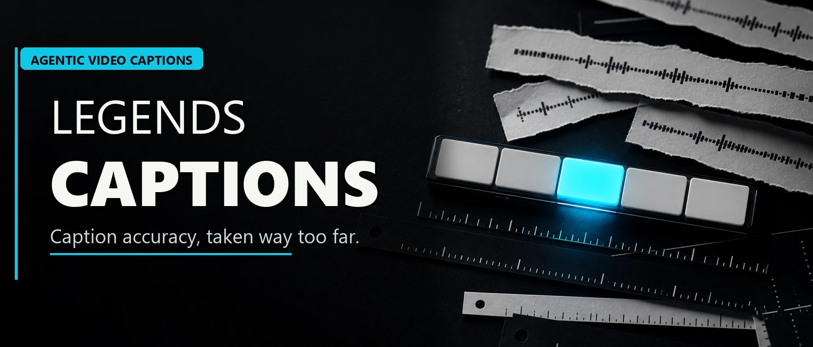

<p align="center">
  
</p>

# Legends Ultimate Captions - Agentic Video Caption System

[](https://github.com/avalonreset/legends-ultimate-captions/releases/latest)
[](https://github.com/avalonreset/legends-ultimate-captions/actions/workflows/tests.yml)
[](LICENSE)


Video captions are easy to generate and painful to trust. Legends Ultimate
Captions is an agentic video caption system that treats transcript correction,
forced alignment, active-word timing, proof frames, and revision memory as one
release workflow instead of a pile of manual cleanup.

This is built for the gap between generic auto captions and real publishing
quality. The system is intentionally overbuilt: it uses context-aware correction
policy, Parakeet-quality ASR, NeMo Forced Aligner timing, ASS caption rendering,
manifest evidence, and final-render QA so the first pass is usually close and
the second pass teaches the next run.

## What It Does

- Builds accurate captions from the exact final video clock.
- Applies contextual ASR correction before render.
- Fixes model names, product names, acronyms, hardware names, and obvious phrase
  errors when the evidence is strong.
- Keeps spoken acronyms such as `L O R A` independently highlightable when the
  speaker spells the term.
- Uses forced alignment as final timing evidence when exact highlights matter.
- Produces active-word ASS captions with consistent visual rules.
- Preserves manifests so every text correction and timing fallback can be
  reviewed later.
- Turns user fixes into reusable policy, config, and regression tests.

## What Makes This Different

| Generic auto captions | Legends Ultimate Captions |
|---|---|
| Trusts ASR text too much | Treats ASR as evidence, not the editor |
| Often misses domain terms | Uses glossary and contextual correction |
| Word timing can be rough | Uses forced alignment when timing matters |
| Fixes disappear after the run | Revisions become policy and tests |
| Proofing is manual and informal | Requires manifests and proof-frame QA |

The goal is not to make another one-click caption toy. The goal is a caption
deployment system that can take a real creator video, apply captions, catch the
obvious nonsense, and leave behind enough evidence for an agent to improve.

## Quick Start

```powershell
git clone https://github.com/avalonreset/legends-ultimate-captions.git
Set-Location -LiteralPath .\legends-ultimate-captions
python -m venv .venv
.\.venv\Scripts\python.exe -m pip install -e .
.\.venv\Scripts\legends-captions.exe doctor
```

Try the policy engine:

```powershell
.\.venv\Scripts\legends-captions.exe normalize --uppercase "low raw teaches the model"
.\.venv\Scripts\legends-captions.exe normalize --uppercase "it may not be as exacting 2.0,"
.\.venv\Scripts\legends-captions.exe normalize --manifest "L O R A."
```

Run tests:

```powershell
powershell -ExecutionPolicy Bypass -File .\scripts\run-tests.ps1
```

Or on any platform with Python 3.10+:

```sh
python -m unittest discover -s tests
```

## Caption Policy Examples

| Heard by ASR | Display policy |
|---|---|
| `low raw` | `LoRA` |
| `C dance 2.0` | `Seedance 2.0` |
| `exacting 2.0` in AI-video context | `exciting as Seedance 2.0` |
| `what is this unlock` | `what does this unlock` |
| `sticking the 30` | `sticking to 30` |
| `L O R A` | preserve per-letter highlight timing |

## Agent Support

This repo includes a thin adapter for each agent surface:

- `AGENTS.md` for Codex project instructions.
- `CLAUDE.md` and `.claude/skills/legends-ultimate-captions/SKILL.md` for Claude Code.
- `GEMINI.md` and `gemini-extension.json` for Gemini CLI.
- `skills/legends-ultimate-captions/SKILL.md` as the portable Agent Skills entrypoint.

All adapters point to the same policies and the same CLI. There should not be a
Codex version of the caption workflow, a Claude version, and a Gemini version.
There is one caption doctrine with agent-specific launch surfaces.

## Project Map

```text
.raw/       preserved source notes, scripts, manifests, and run evidence
assets/     README banner and social preview
configs/    reusable caption style and correction defaults
docs/       install, architecture, compatibility, release, and QA docs
release/    Skool post drafts and promo copy (art staging stays local)
skills/     portable Agent Skills package
src/        Python package for policy, correction, ASS helpers, and manifests
tests/      regression tests created from real caption fixes
wiki/       product brain for policies, playbooks, agents, and QA
```

## Where Transcripts Come From

This module corrects, times, and renders captions. It does not record audio
or run ASR itself. Get transcripts from the Legends module that fits:

- `legends-ambient-intelligence` for recorded audio: voice memos, recorder
  ingest, and offline Whisper or Parakeet transcription.
- `hyperyap` for live dictated text.
- `legends-yt-dlp` subtitle fetch for pulled video.

Then bring the text here for correction policy, forced-alignment timing,
active-word rendering, and proof evidence.

## Documentation

- [Architecture](docs/architecture.md)
- [Agent compatibility](docs/agent-compatibility.md)
- [Install guide](docs/install/agent-install-guide.md)
- [Release checklist](docs/release-checklist.md)
- [Caption QA policy](wiki/policies/Caption%20Intelligence%20Policy.md)
- [Revision learning policy](wiki/policies/Revision%20Learning%20Policy.md)

## Status

Current release: `v0.1.0`.

License: MIT. See
[LICENSE](LICENSE).

Repository target: `avalonreset/legends-ultimate-captions`.
